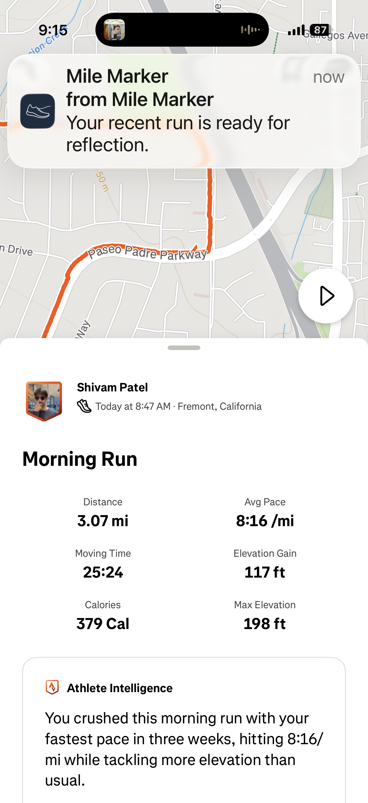
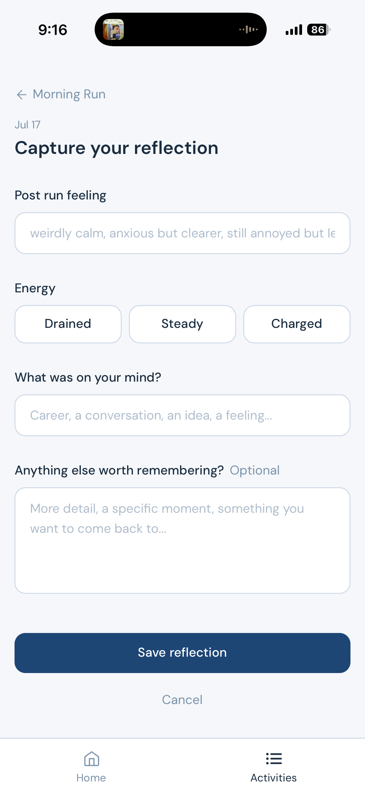
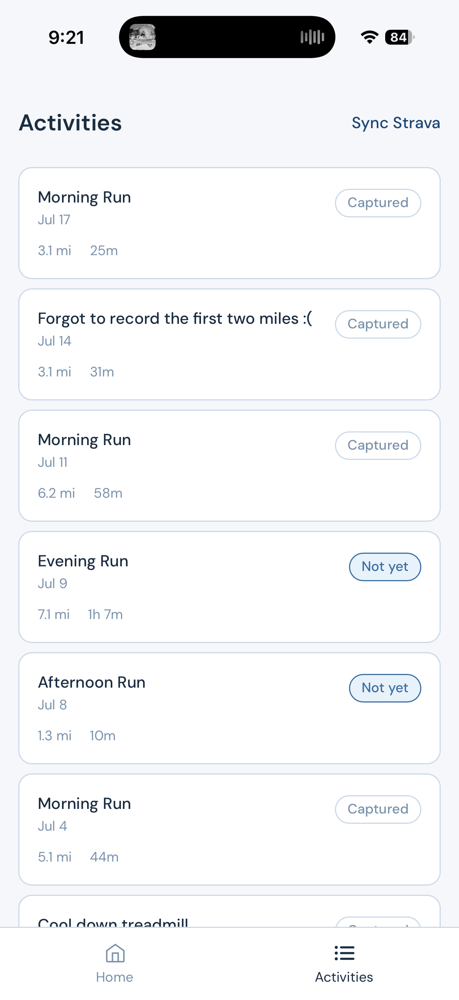

# Mile Marker

A private, post-run reflection journal that syncs with Strava.

**[Try it → mile-marker-v1.vercel.app](https://mile-marker-v1.vercel.app)**

<p>
  
  
  
</p>

## Description

I am a believer that simple activities we do every day are overlooked forms of therapy. Running for me is the most reliable way to process and make sense of life. During runs I often achieve a striking clarity of thought, yet struggle to retain these insights days after. 

Mile Marker treats every completed run as an invitation to capture reflections. Finish a run, post it to Strava get an immediate nudge, and capture a short private reflection: feeling, energy level, and any notes on what you were thinking about during the run. No public feed, no analytics dashboard. Just a running (pun intended) journal tied to your runs. 

Over time, I plan to build intelligent capabilities that synthesize across your independent run reflections and surface themes. 

How is this different from Strava? Strava I’ve found is great for logging *what* happened on a run (pace, distance, etc.) but not capturing *how it felt*. 


## How it works

**Stack:** Next.js 16 (App Router, Turbopack) · React 19 · Tailwind v4 · Supabase (Postgres, Auth, RLS)

**Auth & data** — Supabase magic-link auth is the identity layer. Every table (`activities`, `reflections`) is protected by row-level security scoped to `auth.uid()`, so each user only ever sees their own data.

**Strava connection** — Users link their Strava account from inside Mile Marker (Supabase stays the login; Strava is a linked data source, not a replacement auth provider). Tokens live in a `strava_connections` table with RLS enabled and **no policies** — deny-by-default, even for the owning user. All reads/writes go through two Postgres `SECURITY DEFINER` functions hard-scoped to the calling user's `auth.uid()`. Access/refresh tokens are never sent to the browser, in any form.

**Sync** — Activities reach Mile Marker three ways:
- **Auto-sync** on first connect (pulls recent history)
- **Manual sync** button
- **Strava webhook** — a subscription that notifies Mile Marker the moment a new run is posted, so reflections can be prompted in near real time instead of waiting on the next manual sync

Only runs are synced (rides, swims, and other workout types are filtered out) — the reflection prompt is run-specific by design.

**Notifications** — When the webhook reports a new run, Mile Marker sends a Web Push notification (VAPID) inviting the user to reflect, deep-linking straight to that run's reflection form.

## Run it yourself

The hosted app is multi-user, so most people don't need to self-host — sign in with your own Strava account at the link above. If you want to run your own instance:

```bash
git clone https://github.com/shivamapatel/mile-marker.git
cd mile-marker
npm install
```

**1. Supabase project** — create a project at [supabase.com](https://supabase.com), then recreate the schema described above: `activities`, `reflections`, `strava_connections`, `push_subscriptions`, and `notification_deliveries` tables, RLS policies as described in [How it works](#how-it-works), and the `store_strava_connection` / `get_strava_connection_status` `SECURITY DEFINER` functions.

**2. Strava app** — register one at [strava.com/settings/api](https://www.strava.com/settings/api). Set "Authorization Callback Domain" to `localhost` for local dev (or your deployed domain in production).

**3. VAPID keys** for Web Push — generate with `npx web-push generate-vapid-keys`.

**4. Environment variables** — copy `.env.local.example` to `.env.local` and fill in:

```
NEXT_PUBLIC_SUPABASE_URL=
NEXT_PUBLIC_SUPABASE_ANON_KEY=
SUPABASE_SERVICE_ROLE_KEY=
STRAVA_CLIENT_ID=
STRAVA_CLIENT_SECRET=
STRAVA_REDIRECT_URI=http://localhost:3000/api/strava/callback
STRAVA_WEBHOOK_VERIFY_TOKEN=
NEXT_PUBLIC_VAPID_PUBLIC_KEY=
VAPID_PRIVATE_KEY=
VAPID_SUBJECT=
```

**5. Run it:**

```bash
npm run dev
```

Open [http://localhost:3000](http://localhost:3000).

Note: the Strava webhook only works against a publicly reachable URL, so it won't fire on `localhost` unless you tunnel it (e.g. ngrok) and register the subscription with Strava's API.
